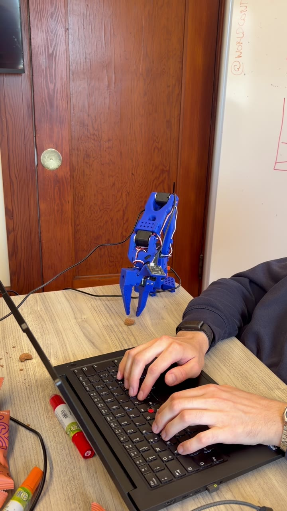

# RoboticsHackCal

**Autonomous robotic peanut handoff** — built at the Robotics Hackathon at Cal.

An SO-101 arm picks up a peanut and presents it to a person, driven by an ACT
policy trained on our own teleoperated demonstrations. The autonomous rollout
worked on hardware; the ElevenLabs voice-to-robot path remained unfinished at
the event and is kept here as an integration prototype.

```
voice prototype ──> approved-task allowlist ──> lerobot-rollout ──> ACT policy ──> SO-101 arm
```

## Demo

[](docs/feedbot-demo.mp4)

The video was recorded on August 30, 2026. It shows a command-line-launched
autonomous handoff on the physical arm; it is not evidence of a completed
voice-to-motion run.

## How it works

1. **Demonstrations** — we teleoperated the SO-101 with a leader arm and
   recorded peanut-handoff episodes with LeRobot (single robot-mounted
   camera, 640×480 @ 30 fps).
2. **Training** — an ACT (Action Chunking Transformer) policy was trained
   for 20k steps on those episodes: image + 6-DOF joint state in, 6-DOF
   joint actions out.
3. **Deployment** — `lerobot-rollout` runs the checkpoint on the physical
   arm in a closed loop.
4. **Voice prototype** — an ElevenLabs conversational agent exposes exactly one tool,
   `run_robot_task(task_id="peanut_handoff")`. A local allowlist maps that ID
   to the checkpoint and can launch the rollout. This code path was not
   validated end to end on hardware during the event.

## My contribution

I implemented the SO-101/SmolVLA hardware integration, corrected the checkpoint
joint-unit handling, added the safety-gated runner and ACT launch bridge, and
consolidated the recording, training, setup, and review documentation. Teammates
contributed the initial ElevenLabs agent prototype and participated in the
hardware build, data collection, and demo.

## Repository layout

| Path | What it is |
|---|---|
| `voice-agent/` | ElevenLabs prototype and ACT launch bridge; not validated end to end on hardware |
| `so101-vla/` | SmolVLA experiments and generic record/train helper scripts |
| `lerobot/` *(local only, gitignored)* | LeRobot checkout holding the recorded datasets and trained checkpoints (14 GB — not pushed) |

## Trained checkpoints

Both live under `lerobot/outputs/train/` on the robot laptop:

| Checkpoint | Training data | Episodes |
|---|---|---|
| `act_so101_nut_handoff_v3` | `so101_nut_handoff_v3` | 29 |
| `act_so101_nut_handoff_all_v1` | all handoff recordings combined | 57 |

## Running the arm

Verified working on hardware:

```bash
cd ~/RoboticsHackCal/lerobot && source .venv/bin/activate

lerobot-rollout \
  --strategy.type=base \
  --policy.path=outputs/train/act_so101_nut_handoff_v3/checkpoints/last/pretrained_model \
  --robot.type=so101_follower \
  --robot.port=/dev/serial/by-id/usb-1a86_USB_Single_Serial_58CD177001-if00 \
  --robot.id=hack_follower \
  --robot.cameras='{front: {type: opencv, index_or_path: /dev/video4, width: 640, height: 480, fps: 30}}' \
  --robot.max_relative_target=5.0 \
  --task="Pick up the peanut and present it in front of the target." \
  --device=cuda \
  --duration=30 \
  --display_data=false
```

Notes:
- The ACT policy takes no language input — `--task` is logging metadata only.
- `Relative goal position ... clamped` log lines are the safety limiter
  working as intended.
- The arm starts moving as soon as the rollout begins; there is no preview
  mode. Disconnect the leader arm first.

## Voice control

```bash
cd ~/RoboticsHackCal/lerobot && source .venv/bin/activate
pip install -r ../voice-agent/requirements.txt

cd ~/RoboticsHackCal/voice-agent
python setup_elevenlabs_agent.py --api-key sk_your_key   # one-time agent creation
python voice_robot_agent.py --dry-run                    # voice only, no hardware
python voice_robot_agent.py --camera=/dev/video4 --enable-motion   # experimental hardware path
```

`setup_elevenlabs_agent.py` creates the ElevenLabs agent (system prompt and
tool schemas are defined in the file) and writes a gitignored `config.py`
with your credentials. `--enable-motion` is required for any hardware run;
without it the tool call is refused. Saying "stop", "cancel", or "abort"
requests interruption of the running rollout. Treat the physical power switch
as the emergency stop.

## Reproducibility

The trained ACT checkpoints and demonstration datasets are not committed, so
the final hardware behavior cannot be reproduced from this repository alone.
The clone does contain the exact launch configuration, reusable record/train
helpers, and a software-only syntax check:

```bash
python -m py_compile \
  voice-agent/voice_robot_agent.py \
  voice-agent/setup_elevenlabs_agent.py \
  so101-vla/vla.py \
  so101-vla/run_inference.py \
  so101-vla/run_robot.py
```

The offline SmolVLA smoke test is separately documented in
[`so101-vla/README.md`](so101-vla/README.md); it downloads a public checkpoint
and does not reproduce the ACT peanut-handoff policy.

## `so101-vla/`

Earlier experiments with the pretrained
`semi01/smolvla_official_so101_pickplace` SmolVLA checkpoint (a pick-and-place
task, two-camera setup), plus reusable helpers:

- `run_inference.py` — offline SmolVLA smoke test, no robot needed
- `run_robot.py` — SmolVLA hardware runner (read-only by default; requires
  `--enable-motion` and typing `MOVE` before the arm moves)
- `record_so101.sh` / `train_policy.sh` — record teleop demonstrations and
  fine-tune a policy on them
- `transfer_weights.py` — experiment injecting a visual encoder pretrained on
  industrial manipulation video (World Context dataset) into SmolVLA

The final demo does not use SmolVLA — the team selected the ACT checkpoint
after qualitatively more reliable runs on the single-camera rig. No controlled
comparison was completed.

## Safety

- Never connect the leader arm during autonomous rollout.
- Start with a low `--robot.max_relative_target` and raise it gradually.
- Keep a hand near the physical power switch; do not rely on voice or software
  interruption as the only emergency stop.
